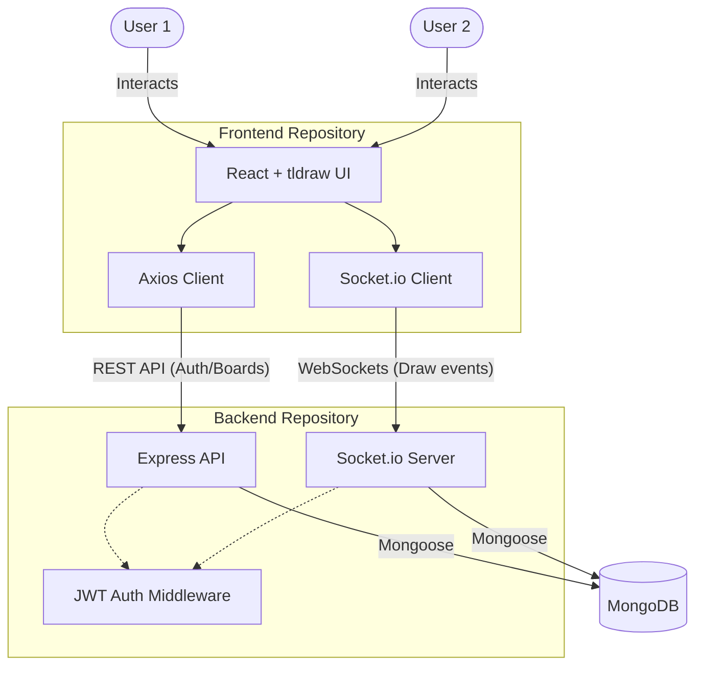

# CollabBoard

> Real-time collaborative whiteboard — draw, brainstorm, and ideate together on an infinite canvas.


## 📐 Architecture



## ✨ Features

- 🎨 **Infinite canvas** powered by [tldraw](https://tldraw.com) — shapes, text, vectors
- ⚡ **Real-time sync** via Socket.io with sub-100ms latency
- 🔐 **JWT auth** securing both REST endpoints and WebSocket handshakes
- 💾 **Board persistence** — resume sessions exactly where you left off
- 👥 **Multi-user** — see collaborators' cursors and changes live
- 🧹 **Ghost session cleanup** — no stale connections or duplicate users

## 🚀 Quick Start

**1. Clone & run the backend**
```bash
git clone https://github.com/soham-kolhe/CollabBoard-backend
cd CollabBoard-backend && npm install && npm run dev
```

**2. Clone & run the frontend**
```bash
git clone https://github.com/soham-kolhe/CollabBoard-frontend
cd CollabBoard-frontend && npm install && npm run dev
```

Open `http://localhost:5173` — sign up, create a board, share the link.

## 📦 Repositories

| Repo | Stack | Description |
|------|-------|-------------|
| [CollabBoard-frontend](https://github.com/soham-kolhe/CollabBoard-frontend) | React · TypeScript · Vite · Tailwind | UI, canvas, real-time client |
| [CollabBoard-backend](https://github.com/soham-kolhe/CollabBoard-backend) | Node.js · Express · Socket.io · MongoDB | API, auth, WebSocket server |

## 🤝 Contributing

Issues and PRs are welcome in either repository!

---

<div align="center">
  <sub>Built by <a href="https://github.com/soham-kolhe">soham-kolhe</a></sub>
</div>
